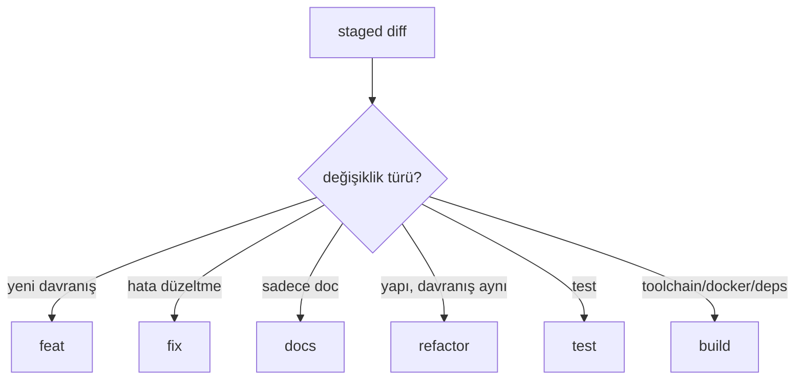

# commit-scribe (Sonnet)

Staged değişikliklerden Conventional Commit mesajı üretir. Başlık ve gövde **İngilizce**.

## Format

```
<type>(<scope>): <short imperative subject>

Why: <optional motivation>
```

## Type seçimi



## Kurallar

- Başlık imperative, ≤ 72 karakter, sonda nokta yok.
- Scope kebab-case (`domain`, `application`, `infra`, `ui`, `claude`, `docs`).
- `BREAKING CHANGE:` footer → MAJOR.
- AI atfı varsayılan **kapalı** (bkz. [03-commit.md](../rules/03-commit.md)).

## İlgili

- [03-commit.md](../rules/03-commit.md) · [changelog-draft](../skills/changelog-draft/SKILL.md)
