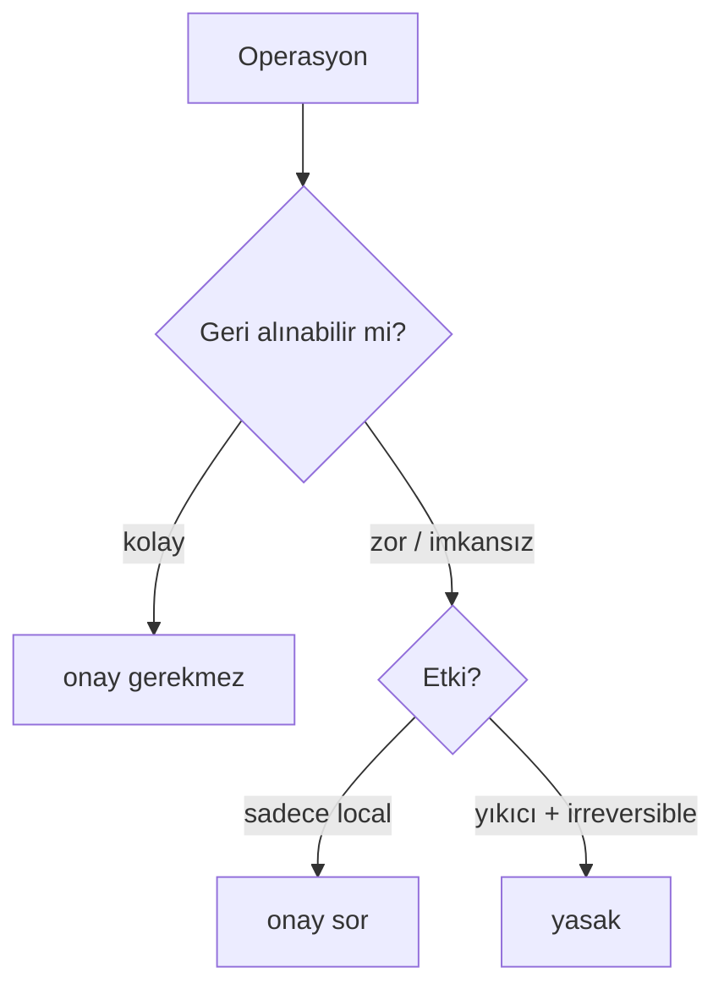

# Kural 02: Güvenlik

**Severity:** error · **Stages:** her tool çağrısı, özellikle Bash

## Kural

Geri-alınması zor, paylaşılan state'i etkileyen veya yıkıcı operasyonlar için **açık kullanıcı onayı**
alınır. Belirli operasyonlar onay alınsa bile tamamen yasaktır. Bu kural `bash-guard` hook'u ile
deterministik olarak da zorlanır.

## Onay zorunlu

| Operasyon | Derece |
|-----------|--------|
| Dosya/dizin silme (`rm`, `git rm`) | onay |
| `git reset --hard`, `git rebase` | onay |
| paket kurulumu (`npm/pip/brew install`) | onay |
| `gh pr create` / `gh pr merge` | onay |
| dış API / upload | onay + mahremiyet uyarısı |

> **Not:** Normal `git push` **onay gerektirmez** — commit ve push birlikte yapılır (kullanıcı
> konvansiyonu; bkz. [03-commit.md](03-commit.md)). Yalnız `git push --force` yasaktır (aşağı).

## Tamamen yasak (onay alınsa bile)

- `rm -rf /`, `rm -rf ~`, `sudo rm`
- `git push --force` (özellikle `main`)
- `git filter-repo` / `filter-branch`
- `dd if=...`, `mkfs`, fork bomb
- `curl | sh`, `wget | sh`
- `--no-verify`, `--no-gpg-sign` (hook/imza bypass)

## Önce araştır, sonra sil

Beklenmeyen state (tanımadık dosya, branch, lock) görülürse: **önce araştır → kullanıcıya raporla →
en son sil**. "Senin oluşturmadığın" veya "tarif edilenle çelişen" bir şeyi silmeden önce durumu bildir.

## Hassas dosyalar

`.env*`, `id_rsa*`, `*.pem`, `*credentials*` okumak açık onay gerektirir; içerik **asla** output'a
yazılmaz. (`settings.json` `deny` listesi bunları ayrıca engeller.)

## İlgili

- [04-izinler.md](04-izinler.md) · [bash-guard hook](../hooks/pre-tool-use/bash-guard.sh)
