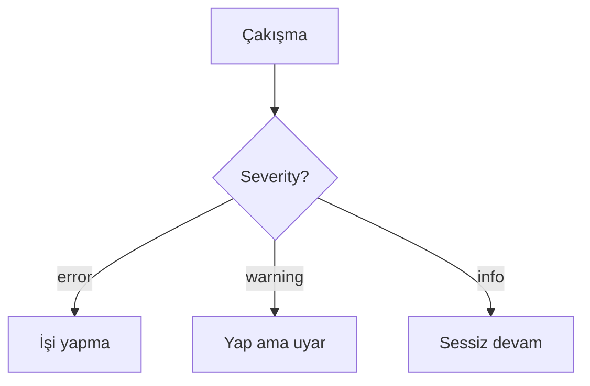

# Rules — proje kuralları (profil + proje)

Her dosya bir **bağlayıcı kural**dır. `CLAUDE.md` tavsiye verir; `rules/` kesin sınırları çizer;
hook'lar ve izin tabanı deterministik olarak zorlar.

## Çekirdek kurallar burada DEĞİL — K1'de (DECISIONS#0044)

`dil` · `guvenlik` · `commit` · `izinler` · `kod-kalitesi` kuralları 2026-09-06'dan itibaren
**makine başına tek nüsha** yüklenir: `~/.claude/rules/ceran/*.md` (`dev eco home install`).
Claude Code kullanıcı kurallarını her projede otomatik bağlar; kopyalarını bu dizine koyma —
kopya kitten `kit/tombstones.yaml` ile kaldırıldı ve `dev eco sync` dokunulmamış kopyayı siler.

| Kural (K1) | Zorlama |
|-----------|---------|
| `dil` | advisory |
| `guvenlik` | `ceran-hooks bash-guard` (K0/K1) · `permissions.deny` tabanı |
| `commit` | advisory |
| `izinler` | `permissions.deny` tabanı (`policy/deny-base.json`) · `dev eco sync --check` |
| `kod-kalitesi` | `format-lint` hook'u · `verify.sh` |

Kaynak: `claude-foundation/home/rules/ceran/`. Politika verisi: `claude-foundation/policy/`.

## Bu dizinde ne durur

```
06-<stack>.md    # profil kuralı — `dev eco sync` profil overlay'inden getirir (flutter, go, python …)
07-<konu>.md     # proje-özel daraltma — ADR'ye bağlı, yalnız DARALTIR, çekirdeği gevşetemez
```

Proje çekirdeği **gevşetemez**: deny tabanı, model allowlist'i, hook kaydı K0/K1'de yaşar ve projenin
dokunabileceği bir dosyada değildir — koruyan kural metni değil yapıdır.

## Severity önceliği


