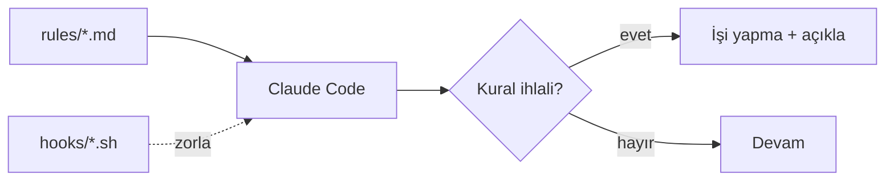
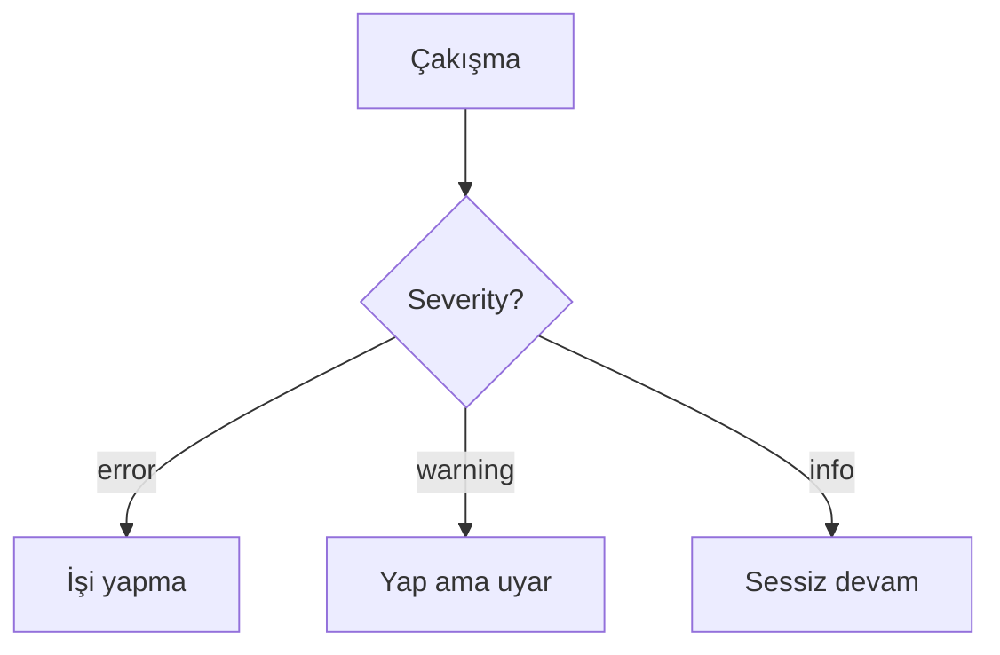

# Rules — Bağlayıcı Policy Belgeleri

Her dosya bir **bağlayıcı kural**dır. `CLAUDE.md` tavsiye verir; `rules/` kesin sınırları çizer;
`hooks/` deterministik olarak zorlar.

## Dosyalar

| Dosya | Severity | Kapsam |
|-------|----------|--------|
| [01-dil.md](01-dil.md) | error | Çıktı Türkçe; teknik terim/kod İngilizce |
| [02-guvenlik.md](02-guvenlik.md) | error | Yıkıcı operasyon listesi, onay zorunluluğu, hassas dosyalar |
| [03-commit.md](03-commit.md) | error | Conventional Commits (İngilizce); AI atfı varsayılan kapalı |
| [04-izinler.md](04-izinler.md) | error/warning | İzin matrisi; önemli işlemler onay |
| [05-kod-kalitesi.md](05-kod-kalitesi.md) | error | SOLID · Clean Code · DRY/KISS/YAGNI · anti-pattern yasakları |

## Severity önceliği

> **Profil notu:** Bu çekirdek set profil-bağımsızdır. Proje-özel kurallar (`06-…`, `07-…`)
> teknolojiye göre eklenir (ör. `06-cpp.md`, `06-flutter.md`, `06-astro.md`).
